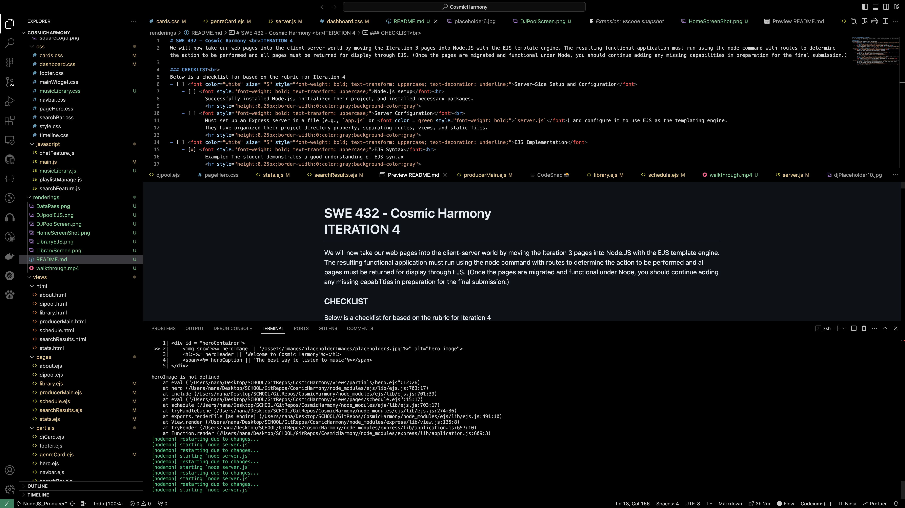
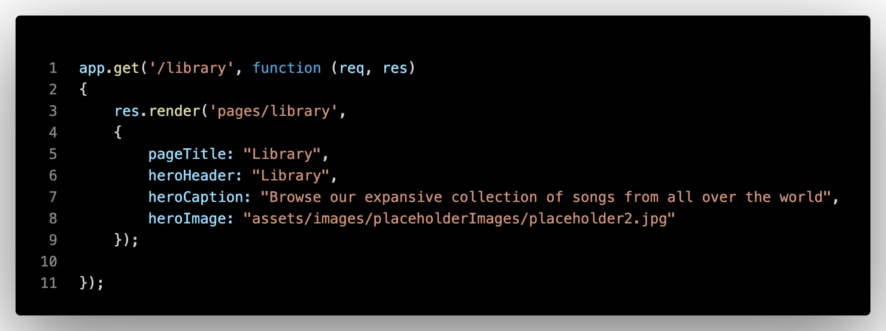
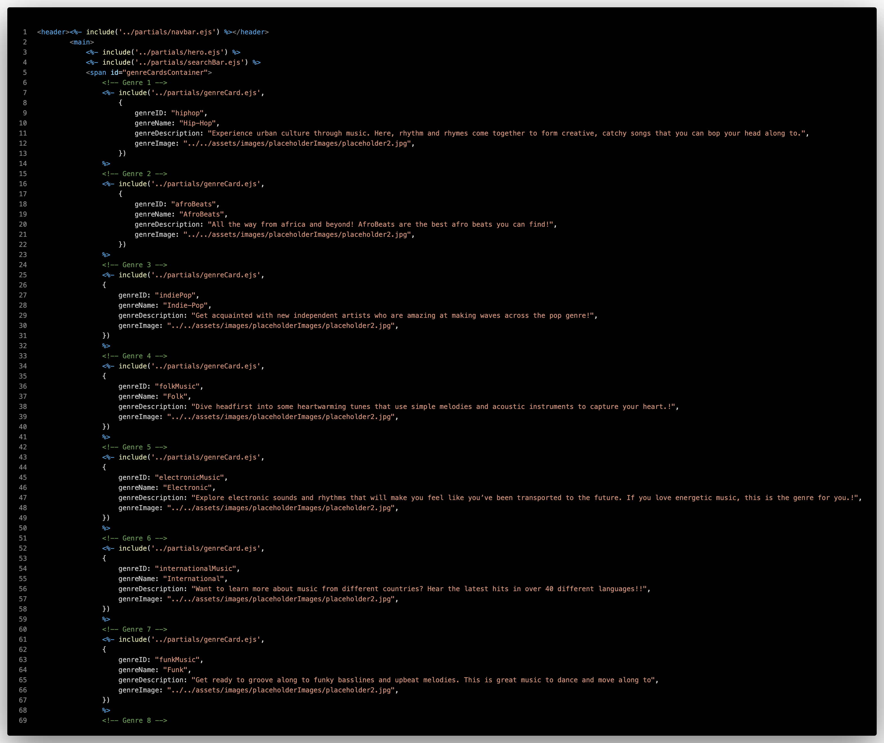

# SWE 432 - Cosmic Harmony  ITERATION 4
We will now take our web pages into the client-server world by moving the Iteration 3 pages into Node.JS with the EJS template engine. The resulting functional application must run using the node command with routes to determine the action to be performed and all pages must be returned for display through EJS. (Once the pages are migrated and functional under Node, you should continue adding any missing capabilities in preparation for the final submission.)

### CHECKLIST 
Below is a checklist for based on the rubric for Iteration 4
- [x] Server-Side Setup and Configuration
    - [x] Node.js setup  
            Successfully installed Node.js, initialized their project, and installed necessary packages.
            

            Node.js setup and installation successfully done as seen in `root/package.json` `root/package-lock.json` `root/node_modules`
    - [x] Server Configuration 
            Must set up an Express server in a file (e.g., `app.js` or `server.js`) and configure it to use EJS as the templating engine.
            They have organized their project directory properly, separating routes, views, and static files.
            

            Server setup using express in `root/server.js` Server runs with no issues as seen in terminal
            
- [x] EJS Implementation
    - [x] EJS Syntax 
            Example: The student demonstrates a good understanding of EJS syntax
            

            EJS syntax utilized through various pages incluing partials. `root/views/partials` `root/views/pages`
    - [x] Data Passing 
            Passing data from their server to their EJS templates successfully. 
            

            
    - [x] EJS Views 
            Created dynamic EJS views for their radio station application, utilized EJS layouts to create all pages.
            

            EJS views setup for various pages. `root/views/pages`
             
            
- [x] Functionality 
            All features of the application are working as expected. Links lead to the correct pages, buttons 
            perform their intended actions, and data is displayed correctly. 
            

            Demo recorded and saved in <a href="walkthrough.mp4">`walkthrough.mp4`</a>
            

### Additional Notes
- Did some additional css for all pages
- Would be implementing playlist creation and search functionality at end of next iteration