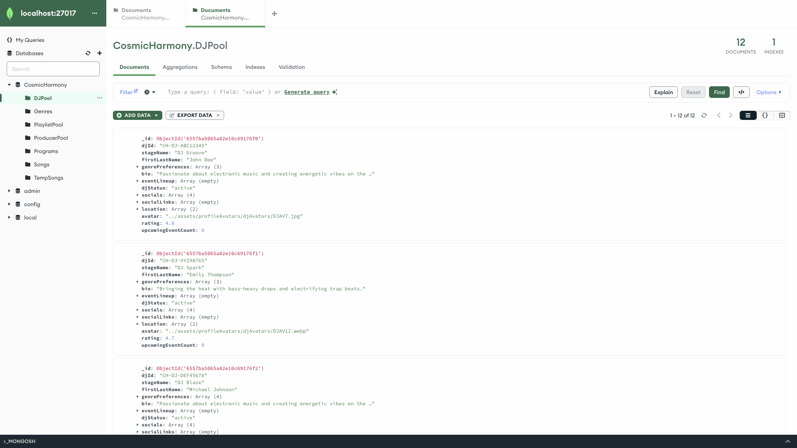
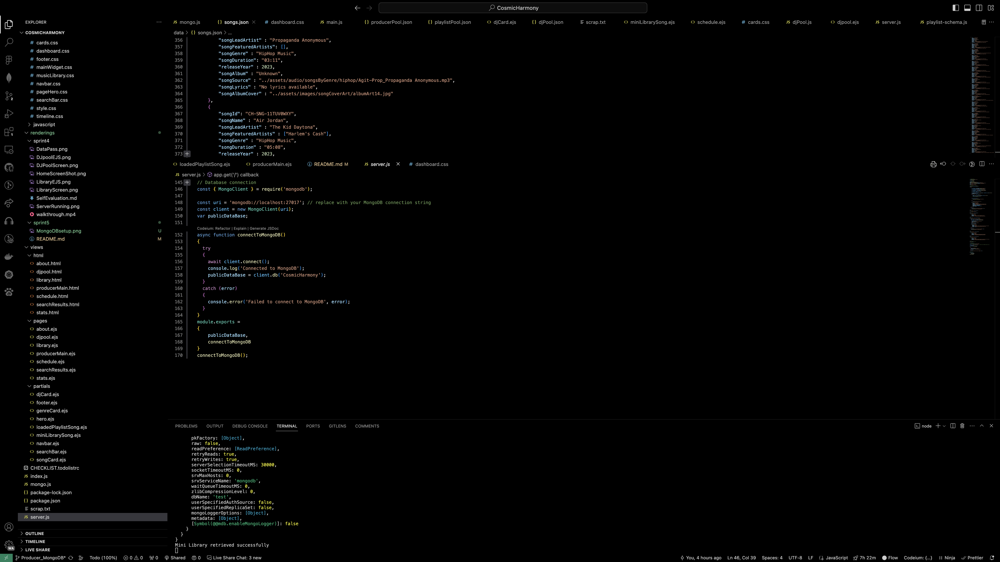

# SWE 432 Sprint 5 - Database and State

## Database Integration and Data Migration (60 points)
### Database Setup
Successful setup of MongoDB, including installation, configuration, and connection to the web
application.

### Data Model Schema Design:
Development of a MongoDB schema that accurately represents the data model for the application's needs, such as songs, DJs, playlists, listener preferences, etc.

### Data Migration
Complete migration of existing data to the new database structure, ensuring that all previously hard-
coded data is now stored and retrieved from the database.
- Migration done using json files in `./data`

